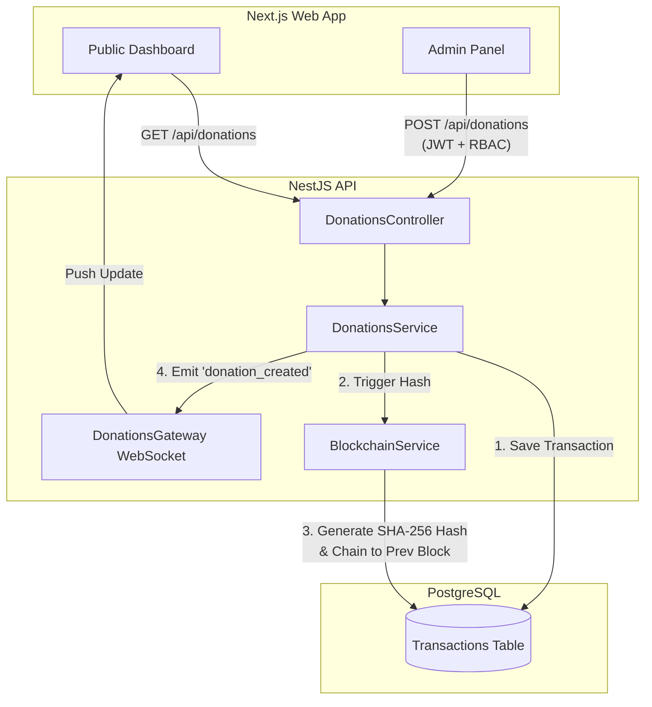

# Wakaf Transparency System Architecture

## System Overview

The Wakaf Transparency System is built using a modern, scalable tech stack aimed at ensuring security, transparency, and data integrity.

- **Frontend**: Next.js 16, React, Tailwind CSS, shadcn/ui.
- **Backend**: NestJS, TypeORM, TypeScript.
- **Database**: PostgreSQL (Supabase).
- **Core Security**: Custom Blockchain (SHA-256) Audit Trail.

## User Journey & Architecture Flow



## Blockchain Audit Trail Mechanism

Every financial transaction in the Wakaf system is treated as a block. The system employs a simplified blockchain mechanism to guarantee that once a record is added, it cannot be altered without breaking the chain.

```mermaid
flowchart LR
    subgraph Block 1 [Genesis Block]
        H1[Prev Hash: 0000...<br>Data: Transaction A<br>Hash: a8f4...]
    end

    subgraph Block 2
        H2[Prev Hash: a8f4...<br>Data: Transaction B<br>Hash: c3b9...]
    end

    subgraph Block 3
        H3[Prev Hash: c3b9...<br>Data: Transaction C<br>Hash: f7d1...]
    end

    Block 1 -->|Hash matches Prev Hash| Block 2
    Block 2 -->|Hash matches Prev Hash| Block 3
```

### Verification Process

When the `/api/donations/verify` endpoint is called:
1. The system retrieves all transactions ordered chronologically.
2. It recalculates the hash for each block using its data and the previous block's hash.
3. If any recalculated hash differs from the stored hash, the system immediately flags the chain as **invalid** (tampered).
